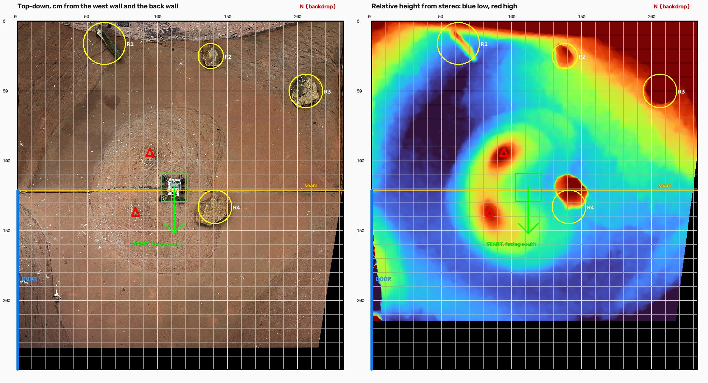

# The real yard, measured

Measured on 5 October 2026 from five phone photos taken on 3 October
(AB#463). One number was taped: the width, 2.33 m. Everything else comes from
the photos, with the rover as the ruler, and
[`yard-measurements/measure_yard.py`](yard-measurements/measure_yard.py)
reproduces all of it from the originals.

*Left: the photos straightened into a top-down map, as the yard was at 15:52
with the rover on its start spot. Right: where the ground rises (red) and
dips (blue), from a stereo pair taken at 14:27, when R4 was sitting on the
seam. That is the blob above its circle. [`yard-top-down.jpg`](yard-measurements/yard-top-down.jpg)
is the left half without the markings.*

## Directions and coordinates

The backdrop wall is **north** and the door is **west**. The photos were taken
from the south.

Positions are in cm from the west wall (x) and from the back wall (y), as on
the map's grid. The simulator puts its origin in the middle with y pointing
north, so for the simulator: `x_sim = x - 116.5`, `y_sim = 124.5 - y`.

## The yard

| What | Value | How sure |
|---|---|---|
| Width, west to east | **233 cm** | Taped. The photos give 231.5 to 232.9 |
| Depth, north to south | **249 cm** | Photos only, within about 2 cm. The front wall hides the last strip of floor from the camera, so if anything it is a little more |
| Seam between the two floor boards | 120 cm from the back wall | Photos, within 1 cm |
| Door | The southern half of the west side, from the seam to the front wall | Confirmed by the team |
| Start | **The middle, on the seam, facing south** | The team's choice. In the photo the rover sat at x 111, y 119, about 5 cm from the exact middle |

## Rocks

All four stay where they are. Sizes are as seen from above; heights were not
measured.

| Rock | x, y | Simulator x, y | Size |
|---|---|---|---|
| R1, long and dark, against the backdrop | 66, 19 | -50.5, +105.5 | 26 x 6 |
| R2 | 138, 27 | +21.5, +97.5 | 13 x 14 |
| R3 | 206, 50 | +89.5, +74.5 | 20 x 22 |
| R4, the big one | 140, 134 | +23.5, -9.5 | 24 x 25 |

R4 is in three different places across the photos: west of the middle at
14:19, on the seam at 14:27, and where the table puts it at 15:52. It was
moved while the photos were being taken. The team confirmed the 15:52 spot is
where it belongs.

## The ground

**Two mounds in the middle**, with their peaks at (95, 84) and (86, 122): the
two bright spots with rings of cracked texture around them. The southern peak
is 25 cm west of the start, so **the rover starts on the eastern slope of a
mound**, not on level ground.

How high they are is not known. The stereo finds them in every pair of photos
tried, in the same places to within 5 cm, but scaling its answer to centimetres gave
anything from 5 to 24 cm depending only on the feature detector's settings.

The stereo also hints at raised back and west edges and a dip on the east
side. Those did not survive the same settings check, so they are not recorded
here as facts.

## How it was measured

Five photos from an iPhone 13, committed in
[`yard-measurements/photos/`](yard-measurements/photos/) as they came off
the phone, with only the GPS location removed from their metadata. The
script runs on them with no arguments; its docstring says how to set it up
and has the detail. In short:

1. **Width.** The rover (185 x 200 mm) is in one photo. That photo is matched
   into the one wide shot that shows all four floor corners, the back half of
   the floor is straightened, and the rover's size in it gives the width.
   It agrees with the tape to within 1%.
2. **Depth.** A rectangle seen through a known lens can only have one aspect
   ratio, so the phone's own lens gives north-south without a ruler. The
   floor's corners come out at 89.3 degrees, which checks both that they were
   picked in the right places and that the floor is a rectangle. For the back
   half, the lens and the rover agree to within 4 cm.
3. **Positions.** Every photo is straightened into the same coordinates, and
   the rocks, the seam and the rover are read off a 1 cm grid. The rover
   measures 18.5 x 20.5 cm on that map, which is its real size.
4. **The ground.** There is no depth map in the photos (the phone saved only
   an HDR gain map). Photos taken seconds apart from different spots are a
   stereo pair, though: the middle of the floor is taken as flat, and
   anything that moves differently from it between the two photos is above or
   below it.

To check how far to trust each number, the whole thing was rerun with six
different feature-detector settings. Width moved between 231.5 and 232.9 cm,
depth between 247.8 and 249.4, the seam between 120.0 and 120.8, and the mound
peaks by up to 5 cm. The heights in centimetres moved by a factor of
four, which is why there are none above.

## Limitations, and two minutes at the next visit

- **North-south is from the photos only.** Run a tape along the west wall.
- **No heights.** Hold a ruler on each mound peak and on each rock.
- **Positions along the back** sit on the backdrop's curved sweep, which
  rises, so they may be a centimetre or two off.
- **The start spot is not marked** on the floor yet (AB#465).

## What this changes

The simulator's yard is 240 x 180 cm: 7 cm too wide and 69 cm too short. Today
it calls the edge too early going north or south. These numbers are the input
to AB#464 (the simulator shows the real yard), AB#465 (the start spot),
AB#466 (catching crashes into rocks and walls) and AB#468 (zones and rocks
per yard).

One decision falls out for AB#465. The rover starts facing south, and the
simulator starts it facing up the screen. Draw the yard with north up and the
rover starts facing down, or turn the map round so that "forward" goes up.
